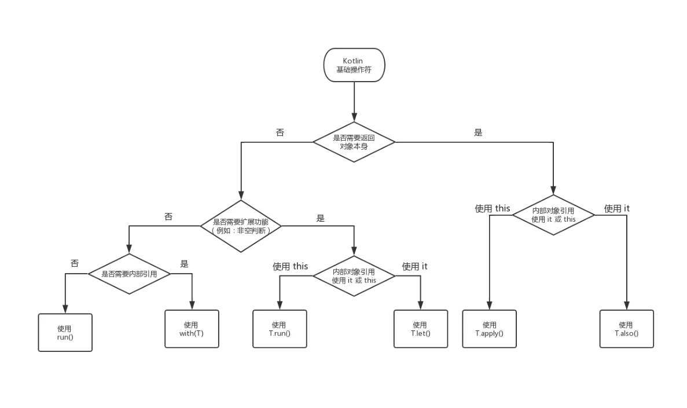

# Kotlin 操作符：run、with、let、also、apply 的差异与选择

看图



```mermaid
graph TD
A(Kotlin 基础操作符) --> B{是否需要返回对象本身}
B --> |是| C{内部对象引用 使用 it 或 this}
B --> |否| D{是否需要扩展功能 例如 非空判断}
C --> |使用 it| E(使用 T\.also\(\))
C --> |使用 this| F(使用 T\.apply\(\))
D --> |是| G{内部对象引用 使用 it 或 this}
D --> |否| H{是否需要内部引用}
G --> |使用 it| I(使用 T\.let\(\))
G --> |使用 this| J(使用 T\.run\(\))
H --> |是| K(使用 with\(T\))
H --> |否| L(使用 run\(\))
```
