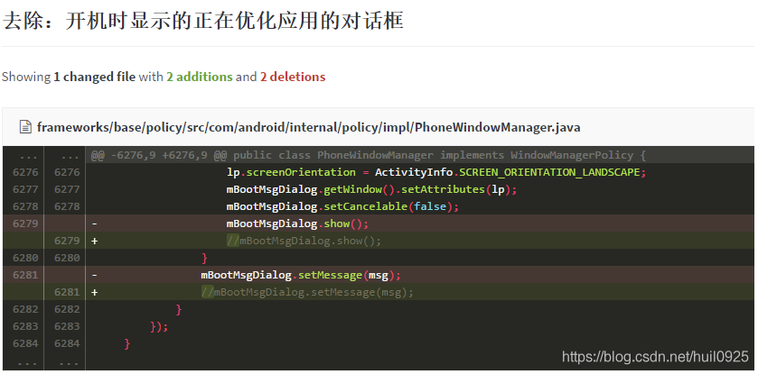

# Android源码修改 去掉开机正在优化应用对话框

目录在

    frameworks/base/services/core/java/com/android/server/pm/PackageManagerService.java

屏蔽如下代码：

```java
if (doTrim) {
    /*if (!isFirstBoot()) {
        try {
            ActivityManagerNative.getDefault().showBootMessage(
                    mContext.getResources().getString(
                            R.string.android_upgrading_fstrim), true);
        } catch (RemoteException e) {
        }
    }
*/
    ms.runMaintenance();
}

Private void performBootDexOpt(PackageParser.Package pkg, int curr, in total) {
    …
    /*if (!isFirstBoot()) {
        …
    }*/
    PackageParser.Package p = pkg;
    …
}
```

[链接](https://blog.csdn.net/Chaos_hu__/article/details/72285334)

另外，还可以

    frameworks/base/policy/src/com/android/internal/policy/impl/PhoneWindowManager.java



[链接](https://blog.csdn.net/huil0925/article/details/95667667)
